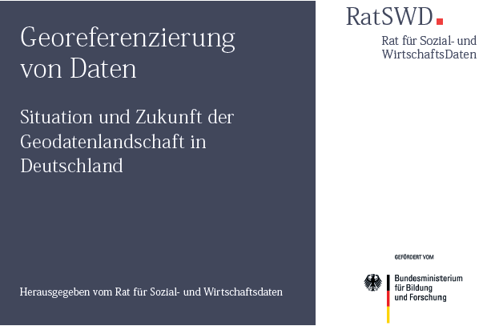
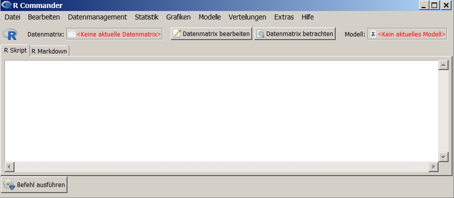
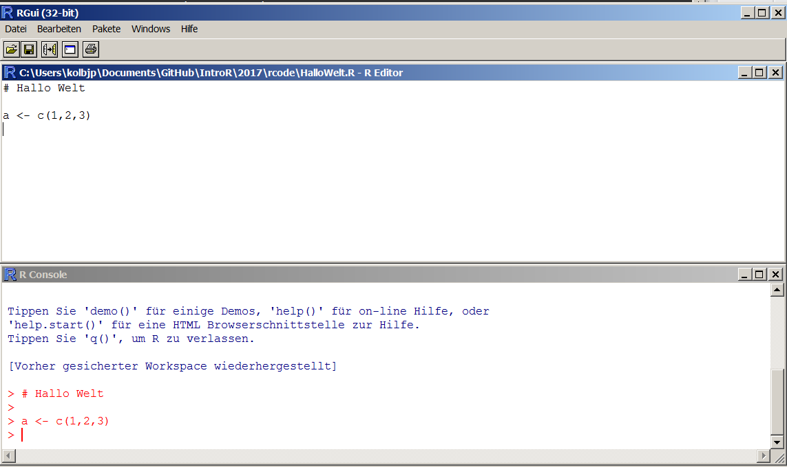
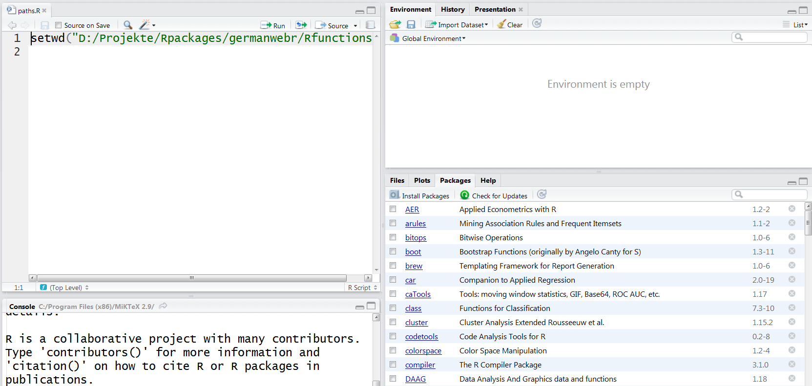
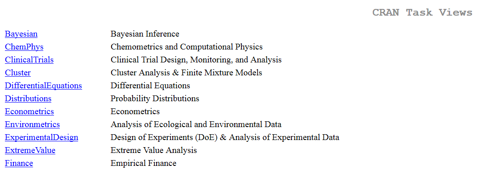
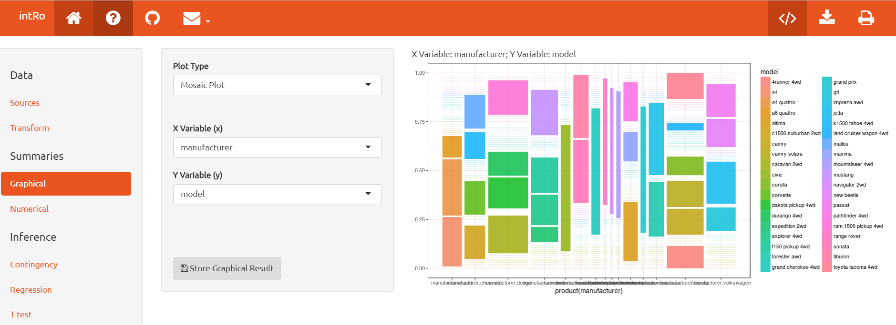
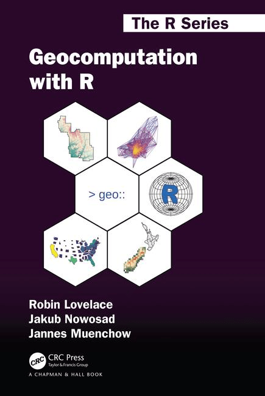
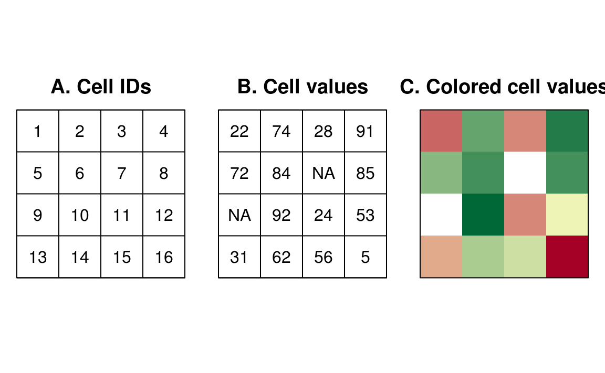

```{r, include=FALSE}
knitr::opts_chunk$set(echo = T)
```


## Disclaimer/ Informationen vorab

Normalerweise gibt es große Unterschiede bei Vorkenntnissen und Fähigkeiten - bitte gebt Bescheid, wenn es zu schnell oder zu langsam geht oder etwas unklar geblieben ist.

- Wenn es Fragen gibt - immer fragen
- In diesem Kurs gibt es viele [**Übungen**](http://web.math.ku.dk/~helle/R-intro/exercises.pdf), denn das Programmieren / die Nutzung von R lernt man am Ende nur allein.
- Ich habe viele [**Beispiele**](https://www.showmeshiny.com/) - probiert sie aus 
- R macht mehr Spaß zusammen - arbeitet zusammen!


### Motivation allgemein

- Raumbezug herstellen/nutzen
- Sekundäranalyse für bestehenden Daten 
- Analysepotentiale der Geokodierung vorstellen
- Verbindung von sozial- mit raumwissenschaftlichen Daten


### Warum die Darstellung in Karten

- Darstellung in Karten ermöglicht besseres Verständnis von sozialwissenschaftlicher Phänomene - Attraktiver Output

- Durch die INSPIRE Richtlinie und *Collaborative Mapping* wächst der verfügbare Bestand an Geodaten.

- Daten sind oft frei verfügbar im Internet (z.B. Nutzung von APIs)
- Die Daten sind oft wenig oder gar nicht strukturiert, heterogen und oft nicht zur räumlichen Visualisierung vorgesehen, beinhalten aber implizit  geographische Informationen (Web 2.0)
- Oftmals sind wenig oder keine Metadaten vorhanden


## Was heißt das für diesen Kurs

### Vorgestellt werden:

- Möglichkeiten für den Download, den Import, die Verarbeitung und die Visualisierung von Geodaten 


<!--
Die Daten auf OSM werden unter der Open Database License (ODbL) 1.0 freigegeben. Das ermöglicht eine Mehrfachverwendung der Daten \citep{schmidt2013extraction}. Die Studie von \cite{barrington2017world} zeigt, dass die Datenqualität von OSM in vielen Ländern bereits ausreichend ist, um sie für wissenschaftliche und analytische Zwecke zu nutzen.
Siehe zum Beispiel das Projekt Simulation of Urban MObility (SUMO) (\citealt{behrisch2011sumo}). Viel mehr Forschung, die in verschiedenen Ländern durchgeführt wird, ist unter \cite{wiki:research} aufgeführt.
-->

- Quellen für Geodaten

- Bspw. die wichtigsten Programmierschnittstellen (APIs) um die Daten zu bekommen

- R-Pakete um diese Daten zu verarbeiten und zu visualisieren


## [Das Thema Geodatenlandschaft](https://www.ratswd.de/dl/downloads/RatSWD_Geodatenbericht.pdf)





## Gründe R zu nutzen...

- ... R ist eine [**quelloffene Sprache**](https://stackoverflow.com/questions/1546583/what-is-the-definition-of-an-open-source-programming-language)

- ... hervorragende [**Grafiken**](http://matthewlincoln.net/2014/12/20/adjacency-matrix-plots-with-r-and-ggplot2.html), [**Grafiken**](https://www.r-bloggers.com/3d-plots-with-ggplot2-and-plotly /), [**Grafiken**](https://procomun.wordpress.com/2011/03/18/splomr/)

- ... [**R kann in Kombination mit anderen Programmen verwendet werden**](https://github.com/Japhilko/RInterfaces) - z.B. zur [**Verknüpfung von Daten**](https://github.com/Japhilko/RInterfaces/blob/master/slides/Datenimport.md)

- ... R kann [**zur Automatisierung**](https://cran.r-project.org/web/packages/MplusAutomation/index.html) verwendet werden

 - ... Breite und aktive Community - [**Man kann die Intelligenz anderer Leute nutzen ;-)**](https://www.r-bloggers.com/)

## R kann in Kombination mit anderen Programmen genutzt werden... 


- Schnittstelle zu: [**Python**](https://cran.r-project.org/web/packages/reticulate/vignettes/calling_python.html), [**Excel**](https://www.springer.com/de/book/9781441900517), [**SPSS**](https://www.ibm.com/support/knowledgecenter/en/SSFUEU_7.2.0/com.ibm.swg.ba.cognos.op_capmod_ig.7.2.0.doc/t_essentials_for_r_statistics.html), [**SAS**](https://cran.r-project.org/web/packages/SASmixed/index.html), [**Stata**](https://cran.r-project.org/web/packages/RStata/index.html)  

<!--
## R für SPSS Nutzer

```{r,eval=F,echo=F}
install.packages("Rcmdr")
library("Rcmdr")
```

### Bob Muenchen - [**R for SPSS and SAS Users **](https://science.nature.nps.gov/im/datamgmt/statistics/r/documents/r_for_sas_spss_users.pdf)

- [**R commander (Rcmdr)**](http://www.rcommander.com/)


-->


## [**Die Beliebtheit von R-Paketen**](https://gallery.shinyapps.io/cran-gauge/)


## Download R:

<http://www.r-project.org/>


## Open Source Programm R


### Das ist das Basis-R:




## Graphical user interface

Viele Leute nutzen ein  [**Graphical User Interface**](https://en.wikipedia.org/wiki/Graphical_user_interface) (GUI) oder ein [**Integrated Development Interface**](https://en.wikipedia.org/wiki/Integrated_development_environment) (IDE).

Aus den folgenden Gründen:

- Syntax-Hervorhebung
- Auto-Vervollständigung
- Bessere Übersicht über Graphiken, Pakete, Dateien, ...

<!--
## Various text editors / IDEs

- [**Gedit**](https://projects.gnome.org/gedit/) with R-specific Add-ons for Linux

- [**Emacs**](http://www.gnu.org/software/emacs/) and ESS (Emacs speaks statistics)- An extensible, customizable, free/libre text editor — and more.

- I use [**Rstudio!**](https://www.rstudio.com/)

](figure/0_overall.jpg)
-->

## RStudio


## A1A Übung - Vorbereitung

- Schaue, ob R auf dem Computer installiert ist
- Wenn nicht, lade [**R**](r-project.org) herunter und installiere es.
- Prüfe ob Rstudio installiert ist.
- Wenn nicht - [**installiere**](http://www.rstudio.com/) Rstudio.
- Starte RStudio. Gehe in die Konsole (meistens Fenster unten links) und tippe

```{r,eval=F}
3+2
```

- Wenn noch kein Skript geöffnet im oberen linken Teil von Rstudio geöffnet ist, gehe zum Menü und öffne ein neues Skript. Checks das Datum mit `date()` und die R version mit `sessionInfo()`.

```{R,eval=F}
date()
```

```{R,eval=F}
sessionInfo()
```

## R ist eine objektorientierte Sprache.

### Vektoren und Zuweisungen

-  `<-` ist der Zuweisungsoperator

```{r}
b <- c(1,2) # create an object with the numbers 1 and 2
```

-  Auf dieses Objekt kann eine Funktion angewendet werden:

```{r}
mean(b) # computes the mean
```

Mit diesen Funktionen können wir etwas über die Eigenschaften des Objekts erfahren:

```{r}
length(b) # b has the length 2
```

### Objektstruktur

```{r}
str(b) # b is a numeric vector
```

<!--
## Funktionen in base-Paket

|Function |Meaning            |Example   |
|:--------|:------------------|:---------|
|str()    |Object structure   |str(b)    |
|max()    |Maximum            |max(b)    |
|min()    |Minimum            |min(b)    |
|sd()     |Standard deviation |sd(b)     |
|var()    |Variance           |var(b)    |
|mean()   |Mean               |mean(b)   |
|median() |Median             |median(b) |

Diese Funktionen benötigen nur ein Argument.

## Funktionen mit mehr Argumenten

### Andere Funktionen benötigen mehr Argumente:

|Argument   |Bedeutung         |Beispiel       |
|:----------|:-----------------|:--------------|
|quantile() |90 % Quantile     |quantile(b,.9) |
|sample()   |Draw a sample     |sample(b,1)    |

 

```{r}
quantile(b,.9)
sample(b,1) 
```

## Funktionen mit einem Argument

```{r}
mean(b)
median(b)
```


## Beispiele - Funktionen mit mehr als einem Argument

```{r}
max(b)
min(b)
sd(b)
var(b)
```


## [**Überblick Funktionen**](http://cran.r-project.org/doc/manuals/R-intro.html)

<http://cran.r-project.org/doc/manuals/R-intro.html>


-->

## A1B Übung - Zuweisungen und Funktionen

Erstellen Sie einen Vektor `b` mit den Zahlen von 1 bis 5 und berechnen Sie....

1. den Mittelwert

2. die Varianz

3. die Standardabweichung

4. die Quadratwurzel aus dem Mittelwert

## [**Wo man Routinen findet**](https://stats.idre.ucla.edu/r/seminars/intro/)

```{r,eval=T,echo=F}
# http://blog.revolutionanalytics.com/2015/06/how-many-packages-are-there-really-on-cran.html
CRANmirror <- "http://cran.revolutionanalytics.com"
cran <- contrib.url(repos = CRANmirror, 
                      type = "source")
info <- available.packages(contriburl = cran, type = "source")
# nrow(info)
```


- Viele Funktionen sind in Basis-R enthalten. 
- Viele spezifische Funktionen sind in zusätzliche Bibliotheken integriert.
- R kann modular durch sogenannte Pakete oder Bibliotheken erweitert werden.
- Die wichtigsten Pakete, die auf CRAN gehostet werden (`r nrow(info)` at `r format(Sys.time(), "%a %b %d")`)
- Weitere Pakete findet man z.B. unter [**bioconductor**](www.bioconductor.org)

## [Übersicht R-Pakete](https://www.youtube.com/watch?v=kKI9--Opmso)


## Installation von Paketen

- Die Anführungszeichen um den Paketnamen herum sind für den Befehl `install.packages` notwendig.
- Sie sind optional für den Befehl `library`.
- Man kann auch `require` anstelle von `library` verwenden.

```{r,eval=F}
install.packages("raster")

library(raster)
```

## Installation von Paketen mit RStudio




## Bestehende Pakete und Installation


## Übersicht über viele nützliche Pakete:

- Luhmann - [**Übersicht mit vielen nützlichen Paketen**](http://www.beltz.de/fileadmin/beltz/downloads/OnlinematerialienPVU/28090_Luhmann/Verwendete%20Pakete.pdf)

### Weitere interessante Pakete:

- Das Paket `sf` - bietet Zugang zu [**simple features**](https://de.wikipedia.org/wiki/Simple_Feature_Access).
- Mit dem Paket `leaflet` kann man interaktive Karten erstellen.
- Das Paket `tmap` kann zur Erstellung von thematischen Karten genutzt werden.
- [**Paket `maptools` um Karten zu erzeugen**](http://www.r-bloggers.com/tag/maptools/)


<!--
- Paket für Import/Export - [**`foreign`**](http://cran.r-project.org/web/packages/foreign/foreign.pdf)

- [**`sampling`-Paket für die Stichprobenziehung**](http://iase-web.org/documents/papers/icots8/ICOTS8_4J1_TILLE.pdf)

- `xtable` Paket zur Integration von LateX in R ([**xtable Galerie**](http://cran.r-project.org/web/packages/xtable/vignettes/xtableGallery.pdf))

- [**`dummies` - Paket zur Erstellung von Dummies**](http://cran.r-project.org/web/packages/dummies/dummies.pdf)

- [**Paket `mvtnorm` um eine multivariate Normalverteilung zu erhalten. **](http://cran.r-project.org/web/packages/mvtnorm/index.html)

-->

## Pakete aus verschiedenen Quellen installieren

### Pakete vom CRAN Server installieren

```{r,eval=F}
install.packages("lme4")
```

### Pakete vom Bioconductor Server installieren

```{r,eval=F}
source("https://bioconductor.org/biocLite.R")
biocLite(c("GenomicFeatures", "AnnotationDbi"))
```


### Pakete von Github installieren

```{r,eval=F}
install.packages("devtools")
library(devtools)

install_github("hadley/maptools")
```


## Wie bekomme ich einen Überblick?

- Entdecke Pakete, die kürzlich auf den [**CRAN**](https://mran.microsoft.com/packages/) Server hochgeladen wurden

- Nutze eine Shiny Web-App, die [**Pakete anzeigt, die kürzlich von CRAN**](https://gallery.shinyapps.io/cran-gauge/) heruntergeladen wurden.

- Werfe einen Blick auf eine [**Quick-Liste nützlicher Pakete**](https://support.rstudio.com/hc/en-us/articles/201057987-Quick-list-of-useful-R-packages)

- ...., oder auf eine Liste mit den [**besten Paketen für die Datenverarbeitung und -analyse**](http://www.computerworld.com/article/2921176/business-intelligence/great-r-packages-for-data-import-wrangling-visualization.html),.....

- ...., oder schaue unter [**die 50 meistgenutzten Pakete**](https://www.r-bloggers.com/the-50-most-used-r-packages/)


## CRAN Task Views		
		
- Bezüglich mancher Themen gibt es einen Überblick über alle wichtigen Pakete - ([**CRAN Task Views**](https://cran.r-project.org/web/views/))
- Momentan gibt es 35 Task Views.
- Alle Pakete einer Task-View können mit folgendem Befehl installiert werden: [**command:**](https://mran.microsoft.com/rpackages/)

```{r,eval=F}
install.packages("ctv")
library("ctv")
install.views("Spatial")
```



## A1C Übung -  zusätzliche Pakete

Geh bspw. auf <https://cran.r-project.org/> und suche nach Paketen...

- die sich für interaktive Karten eignen.
- mit denen man thematische Karten erstellen kann
- mit denen man die räumliche Distanz berechnen kann
- mit denen man eine Satelitenkarte bekommen kann


<!--
## Links zum Weiterlesen:


- [**Warum man R zuerst lerneen sollte wenn man Data Science machen möchte**](http://www.r-bloggers.com/why-you-should-learn-r-first-for-data-science/)

- RStudio hat den [**Infoworld 2015 Technology of the Year Award.**](http://www.r-bloggers.com/rstudio-infoworld-2015-technology-of-the-year-award-recipient/) bekommen

- [**Warum R gut für Unternehmen ist**](http://www.fastcolabs.com/3030063/why the r programming language is good for business) 

- Schaut auf [**R-bloggers**](http://www.r-bloggers.com/why-use-r/)
<!--
- [Intro R](http://www.ats.ucla.edu/stat/r/seminars/intro.htm)
- [Intro R II](http://www.ats.ucla.edu/stat/r/sk/)
-->

<!--

- Vergleich zwischen [**python und R**](http://www.dataschool.io/python-or-r-for-data-science/)

- R und Stata - [**Side-by-side**](http://economistry.com/2013/11/r-impact-evaluation-r-stata-side-side/)

- [**AWESOME R**](https://awesome-r.com/)

- [**1000 R tutorials/Links**](https://support.bioconductor.org/p/33781/)

- [**Zwei Minuten Videos auf Github**](https://www.youtube.com/playlist?list=PLcgz5kNZFCkzSyBG3H-rUaPHoBXgijHfC)

-->

<!--
## Shiny App - Einführung in R

http://www.intro-stats.com/


-->


<!--
https://craigwang.shinyapps.io/rPackageStats/
-->


## Robin Lovelace - [Geocomputation with R](https://geocompr.robinlovelace.net/)




## Typen von [simple feature die von `sf` unterstützt werden.](https://geocompr.robinlovelace.net/spatial-class.html)


## Erste Weltkarten

```{r}
library(sf)
library(spData) 
plot(world)
```

## Nur einen Indikator plotten

```{r}
plot(world["lifeExp"],main="Lebenserwartung in Jahren")
```

## Eine andere Darstellungsform

```{r}
 hist(world$lifeExp,col="blue",xlab="Lebenserwartung",
      ylab="Häufigkeit")
```


## [Rasterdaten](https://geocompr.robinlovelace.net/spatial-class.html)




