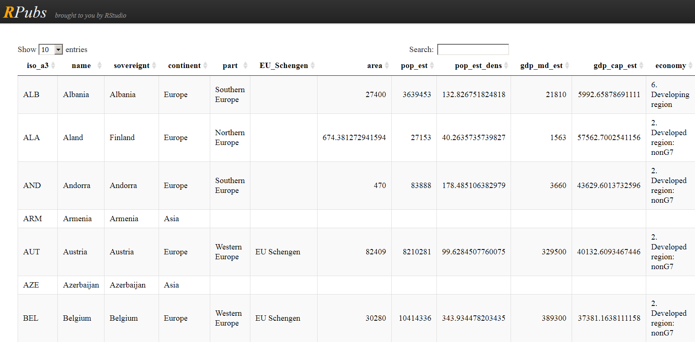

```{r setup_tmap, include=FALSE}
knitr::opts_chunk$set(echo = TRUE,warning=F,cache=T,fig.height=4)
```


## Inhalt dieses Abschnitts

- Das Paket `tmap` wird vorgestellt. 
- Die Datenquelle `naturalearthdata` wird vorgestellt.
- Es wird gezeigt, wie man Karten von Europa, der Welt und einzelnen Ländern erzeugen kann


```{r,echo=F,warning=F,message=F}
library(knitr)
library(DT)
Ex <- T
```

## Das Paket [tmap](https://cran.r-project.org/web/packages/tmap/index.html)

### Thematische Karten

- Mit dem Paket [**tmap**](http://twitter.com/sharon000/status/593028906820599808/photo/1?ref_src=twsrc%5Etfw) kann man thematische Karten erzeugen
- Die olgenden Beispiele basieren auf der [**Vignette**](https://cran.r-project.org/web/packages/tmap/vignettes/tmap-nutshell.html) des Paketes .

```{r,eval=F}
install.packages("tmap")
```


```{r,warning=F,message=F}
library(tmap)
```


## Der `World` Datensatz

### Natural Earth

- Datensatz enthält Informationen von  [**Natural Earth**](http://www.naturalearthdata.com/)

```{r}
data(World)
```


## Der Datensatz `World` im Paket `tmap`

### [Ein Datensatz für die ganze Welt](http://rpubs.com/Japhilko82/tmap_World)

```{r,echo=F,eval=F}
data(World)
datatable(World@data)
```

```{r,echo=F,eval=F}
data(World)
kable(World@data[1:15,])
```

```{r}
data(World)
```


## Der Befehl `qtm` aus dem Paket `tmap`

### Schnelle thematische Karte

- Mit dem Befehl [**qtm**](https://cran.r-project.org/web/packages/tmap/vignettes/tmap-nutshell.html) kann man eine schnelle thematische Karte erzeugen

- Beispiel aus der [**Vignette**](https://cran.r-project.org/web/packages/tmap/vignettes/tmap-nutshell.html) zum Paket `tmap`

```{r,cache=T}
qtm(World)
```

<!--
## Der Europa-Datensatz

```{r,echo=F,eval=F}
# http://rstudio.github.io/DT/
library(DT)
datatable(World, class = 'cell-border stripe',rownames = FALSE,
          options = list(autoWidth = TRUE)
          )
# to see the options http://datatables.net/reference/option/
library(knitr)
kable(World)
```

### [**Der World Datensatz im Paket `tmap`**](http://rpubs.com/Japhilko82/tmap_europe_dataset)


-->


## Um mehr Farbe in die Karte zu bekommen

### Entwicklungsstand der Wirtschaft

<!--
<http://www.naturalearthdata.com/>
-->
```{r,cache=T,eval=Ex}
qtm(World, fill="economy")
```


## Eine Karte mit Text 

### Bevölkerung

```{r,eval=Ex}
qtm(World, fill="pop_est", text="iso_a3")
```

<!--
## Dieses Schema passt besser:

### [**GDP**](https://en.wikipedia.org/wiki/Population_density)

```{r,eval=Ex}
qtm(Europe, fill="gdp_cap_est", text="iso_a3", 
    text.size="AREA", root=5, fill.title="GDP per capita", 
    fill.textNA="Non-European countries", theme="Europe")
```
-->

<!--
```{r,cache=T,eval=Ex}
qtm(Europe, fill="pop_est_dens", 
    fill.title="Population density")
```
-->

## Themen des Europa-Datensatzes

### Verfügbare Variablen im Datensatz

- [**ISO Klassifikation**](http://userpage.chemie.fu-berlin.de/diverse/doc/ISO_3166.html)
- Ländername
- Ist das Land Teil Europas? 
- Fläche, Bevölkerung, Bevölkerungsdichte, 
- [**Bruttoinlandsprodukt**](https://en.wikipedia.org/wiki/Gross_domestic_product)
- Bruttoinlandsprodukt [**zu Kaufkraftparitäten**](https://en.wikipedia.org/wiki/List_of_countries_by_GDP_%28PPP%29_per_capita)
- Ökonomie, Einkommensgruppe

## Der Europa Datensatz - Variablen und was dahinter steckt


```{r,echo=F,eval=Ex}
library(XML)
info <- colnames(Europe@data)

info_df <- data.frame(Europe@data)
kable(info_df[1:8,1:5])
```

<!--
## Die ISO Kodierung: 


```{r,echo=F,cache=T,eval=Ex}
link <- "http://userpage.chemie.fu-berlin.de/diverse/doc/ISO_3166.html"
Tab <- readHTMLList(link)

Tab <- strsplit(x = Tab[[1]],split = "\n")

Tab3 <- Tab[[3]] 

Tab4 <- Tab3[-c(1:7)]
Tab4
```
-->

## Die Variable `continent`

```{r,cache=T}
qtm(Europe, fill="continent")
```


## Die Variable `part`

```{r,cache=T}
qtm(Europe, fill="part",fill.title="Teil von Europa")
```

## Die Variable `area`

```{r,cache=T}
qtm(Europe, fill="area") # Russia is huge
```


## Bevölkerung

```{r,cache=T}
qtm(Europe, fill="pop_est",fill.title="Population") 
```

<!--
## Bevölkerungsdichte

```{r,cache=T}
qtm(Europe, fill="pop_est_dens",
    fill.title="Population density") 
```
-->

## Ökonomie

```{r,cache=T}
qtm(Europe, fill="economy") 
```

## Einkommensgruppe

```{r,cache=T}
qtm(Europe, fill="income_grp",fill.title="Income group") 
```


## Zwei Karten

### Bevölkerung und Entwicklungsstand

```{r,eval=T}
tm_shape(Europe) +
    tm_fill(c("pop_est", "economy"), 
        title=c("Population", "Economy"))
```


## Welt - Länder nach Einkommensgruppe

```{r,cache=T}
qtm(World, fill="income_grp",fill.title="Income group") 
```

## Ein Datensatz zu den Provinzen in den Niederlanden (R-Paket `tmap`)

```{r,echo=F,eval=F}
data(NLD_prov)
NLD_df <- NLD_prov@data
NLD_df[,6] <- round(NLD_df[,6])

datatable(NLD_df[,1:6], class = 'cell-border stripe',rownames = FALSE,
          options = list(pageLength = 10, autoWidth = TRUE)
          )
```

```{r,echo=F,eval=T}
data(NLD_prov)
NLD_df <- NLD_prov@data

kable(head(NLD_df))
        
```

## Niederlande - Bevölkerung in den Provinzen

```{r,cache=T}
qtm(NLD_prov, fill="population",fill.title="population") 
```

<!--
## Niederlande - Anteil der Personen 65 plus

(kleiner Trick notwendig - Die Daten hatten sich verändert)

```{r,cache=T,eval=F}
ant <- runif(length(NLD_prov),.18,.28)
NLD_prov@data$pop_65plus <- 
  round(NLD_prov@data$population*ant)
pop65plus <- NLD_prov@data$pop_65plus
prop65plus <- pop65plus/pop
NLD_prov@data$proportion65plus <- prop65plus
```

## Den Anteil der über 65-jährigen visualisieren

```{r,cache=T,eval=F}
qtm(NLD_prov, fill="proportion",fill.title="proportion") 
```

-->
## Ein Datensatz zu den Gemeinden in den Niederlanden

```{r,cache=T}
data(NLD_muni)
```


```{r,echo=F,eval=F}
NLD_df <- NLD_muni@data
NLD_df[,6] <- round(NLD_df[,6])

datatable(NLD_df[,1:6], class = 'cell-border stripe',rownames = FALSE,
          options = list(pageLength = 10, autoWidth = TRUE)
          )
```

```{r,echo=F,eval=T}
NLD_df <- NLD_muni@data
NLD_df[,6] <- round(NLD_df[,6])

kable(NLD_df[,c("name","province","population")])
```

## Bevölkerung der Gemeinden in den Niederlanden


```{r,cache=T}
qtm(NLD_muni, fill="population") 
```

<!--
## Räumliche Daten zur Flächennutzung

```{r dataland,echo=F,eval=F}
data(land)
info_df <- land@data[1:100,]
datatable(info_df)
```

```{r}
data(land)
data(World)
```


```{r,echo=F,eval=T}
data(land)
info_df <- land@data[sample(1:length(land),10,replace=T),]
kable(info_df[,c(2,3)])
```

```{r,eval=F,echo=F}
?land
```


## Weltweite Flächennutzung

```{r}
tm_shape(land,  relative=FALSE) +
    tm_raster("trees", title="Anteil Waldfläche")
```
-->

## Räumliche Daten zu Metropolregionen


### [UN - World Urbanization Prospects 2018](https://population.un.org/wup/)

```{r}
data(metro)
```

```{r,eval=F,echo=F}
info_df <- metro@data[1:100,]
datatable(info_df)
```

```{r,eval=F,echo=F}
info_df <- metro@data[1:10,]
kable(info_df)
```


```{r,eval=F,echo=F}
DT::datatable(metro@data)
```


<!--
## Nur ein Land visualisieren

```{r}
tm_shape(Europe[Europe$name=="Austria", ]) +
    tm_polygons()
```
-->
