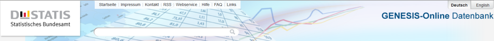
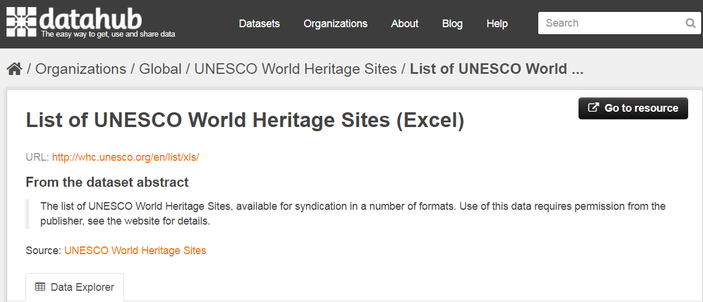
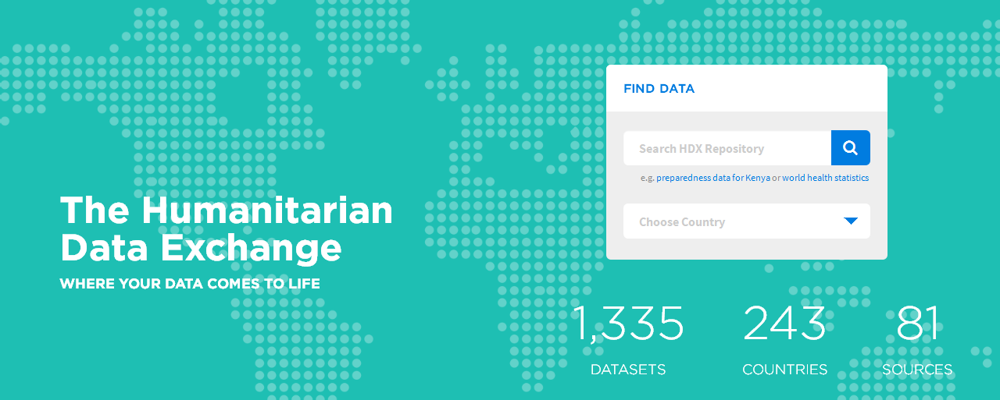
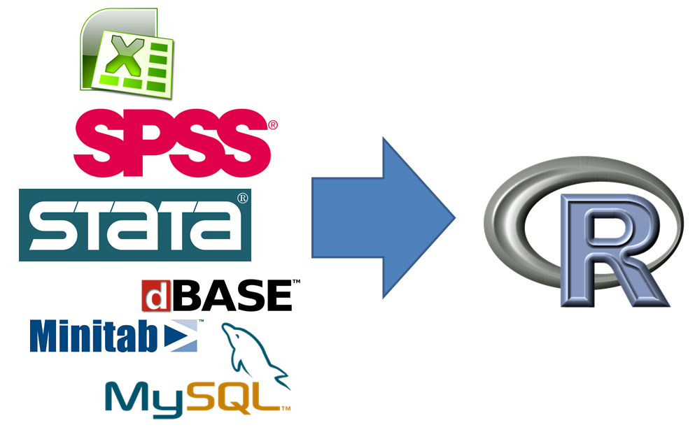
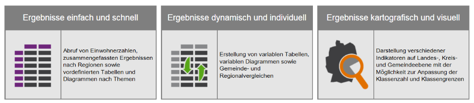
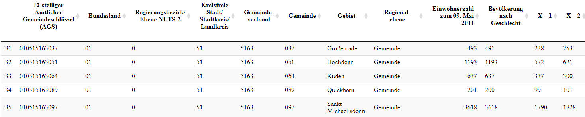
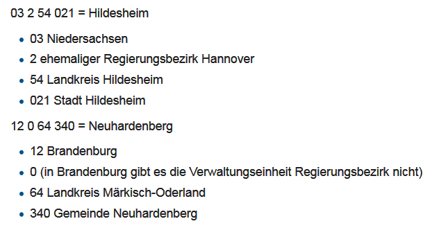
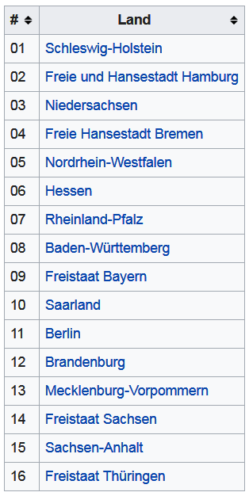

```{r setup, include=FALSE}
knitr::opts_chunk$set(echo = TRUE,cache=T,eval=T,warning=F)
library(knitr)
GESIS <- F
athome <- !GESIS
```

## [EU Initiative INSPIRE](http://inspire.ec.europa.eu/reports/Registration_form.pdf)


<!--
## Datenzugang

- Public-Use-File (PUF) Datei zur öffentlichen Nutzung - meist stark anonymisierte Daten
(Beispiele: [FDZ](www.forschungsdatenzentrum.de), [Statistik Portal](www.statistik-portal.de), [Meine Region](www.infothek.statistik.rlp.de/lis/MeineRegion/index.asp) )

- Scientific-Use-File (SUF) - Datei zur wissenschaftlichen Nutzung - anonymisierte Daten, die zu wissenschaftlichen Zwecken und zur Sekundäranalyse genutzt werden können. 
 
- On-Site-Nutzung - Arbeitsplätze für Gastwissenschaftler - Kontrollierte Datenfernverarbeitung
-->


### Ziele:

- Räumliche Information zugänglicher und interoperabel machen
- Nachhaltige Entwicklung in diesem Bereich unterstützen

### Entwicklung

- Aufgrund der  Richtlinie sind mehr Daten frei verfügbar.


## Forschungsdatenzentren

- Bspw. FDZ der statistischen Ämter:

<http://www.forschungsdatenzentrum.de/>

- Es werden hauptsächlich Public Use Files angeboten, 

- Teilweise können Gewichtungsfaktoren verwendet werden um regionale Ergebnisse zu bekommen

- In der Regel ist Darstellung in Karten aber schwierig

## Weitere Amtliche Datenquellen

- Die Regionaldatenbank [**Genesis**](https://www-genesis.destatis.de/genesis/online)



- Daneben gibt es Angebote der Landesämter bspw das Angebot des [**statistischen Landesamts Rheinland-Pfalz**](https://www.statistik.rlp.de/de/regional/meine-heimat/)


## Eurostat Daten

### Beispiel: Principal European Economic Indicators

<http://ec.europa.eu/eurostat/web/euro-indicators/peeis>

```{r,echo=F,eval=GESIS}
eurostatpath <- "J:/Work/Statistik/Kolb/Workshops/2015/Spatial_MA/Folien/dataImport/data/"
```

```{r,echo=F,eval=athome}
eurostatpath <- "D:/Eigene Dateien/Dokumente/GitHub/ps_2017_11_user_stuttgart/data/"
```


```{r,eval=T}
library(xlsx)
HHsr<-read.xlsx2(paste0(eurostatpath,"HHsavingRate.xls"),1)
```

```{r,echo=F,eval=T}
kable(HHsr[1:4,1:5])
```


<!--
- Laden Sie die Daten für den Inflationsindikator von Eurostat herunter.

<http://ec.europa.eu/eurostat/web/euro-indicators/peeis>
-->


## A3A Übung: Download von Eurostat Daten

- Gehe auf die Website mit den *Principal European Economic Indicators* und lade die Statistik der Sparquote [**hier**](http://ec.europa.eu/eurostat/web/euro-indicators/peeis) herunter.
- Importiere die Daten in R mit einem geeigneten Befehl.


## Daten - Institut für ökologische Raumforschung (IÖR)


- Hier gibt es bspw. Indikatoren zu Nachhaltigkeit, Siedlung, Gebäuden, Verkehr etc. 
- Es könnte also interessant sein, diese Daten an das Gesis Panel anzuspielen
- Aber dazu später mehr


## Datahub.io

- Auf dieser Plattform sind sehr viele Daten vorhanden, 
- bspw. der UNESCO [**Weltkulturerbe**](http://datahub.io/dataset/unesco-world-heritage-sites/resource/d4116195-44d8-4bc1-9f91-9b570870dc19) Datensatz, den ich in der Folge auch in Beispielen verwenden werde. 



<!--
- Funktioniert nur im Windows Explorer ?????!!!!
-->

```{r,eval=F,echo=F}
setwd("J:/Work/Statistik/Kolb/Workshops/2015/Spatial_MA/Folien/dataImport/data")
```


```{r,echo=F,cache=T,eval=F}
load("whc.RData")
```

```{r,echo=F,eval=F}
whc2 <- whc[4:8,c("name_en","longitude","latitude","category_short")]
whc2$longitude <- round(whc2$longitude,2)
whc2$latitude <- round(whc2$latitude,2)
kable(whc2)
```

|   |name_en                 | longitude| latitude|category_short |
|:--|:-----------------------|---------:|--------:|:--------------|
|4  |Butrint                 |     20.03|    39.75|C              |
|5  |Al Qal'a of Beni Hammad |      4.79|    35.82|C              |
|6  |M'Zab Valley            |      3.68|    32.48|C              |
|7  |Djémila                |      5.74|    36.32|C              |
|8  |Timgad                  |      6.63|    35.45|C              |


## American Community Survey

### [Die Daten des *American Community Survey:*](http://www.census.gov/acs/www/)


## [The Humanitarian Data Exchange](data.hdx.rwlabs.org)

### Zum Beispiel Daten zur [Ebola Epedemie](https://data.hdx.rwlabs.org/dataset/rowca-ebola-cases)



<!--
- Zum Beispiel Ebola Fälle
-->


## Weltbank Daten

- AG.AGR.TRAC.NO - [**Agricultural machinery, tractors**](https://data.worldbank.org/indicator/AG.AGR.TRAC.NO)

```{r,eval=F}
library(WDI) 
WDI_dat <- WDI(country="all",
    indicator=c("AG.AGR.TRAC.NO",
    "TM.TAX.TCOM.BC.ZS"),
    start=1990, end=2000)
```

- Es gibt auch eine Funktion `WDIsearch` mit der man nach Indikatoren suchen kann

```{r,eval=F}
head(WDI_dat)
```

```{r,eval=F,echo=F}
kable(head(WDI_dat))
```

```{r,eval=F,echo=F}
datatable(WDI_dat)
```

<!--
## [London Datastore](http://data.london.gov.uk/dataset)


## Ein Beispieldatensatz für London

```{r,eval=F,echo=F,message=F,warning=F}
st_layers("../data/london_sport.shp")
london <- st_read("../data/london_sport.shp")
DT::datatable(london)
```


-->


## Datenimport



## Daten mit RStudio importieren

### RStudio Funktionalität um Daten zu importieren

- Environment - Import Dataset - Filetyp auswählen


## Wo findet man die Daten?

### Browse Button in RStudio
<!--
- You have a Browse Button in RStudio
-->


### Code Vorschau in Rstudio

<!--
- Here you can copy the code
-->


## Zensus Atlas

Für den Zensus 2011 kann man Daten herunterladen und/oder diese in Karten visualisieren.

### https://ergebnisse.zensus2011.de/



## [Zensus Gemeindeergebnisse](https://www.destatis.de/DE/Methoden/Zensus_/Zensus.html)

```{r,eval=F,echo=F}
zen_path <- "D:/GESIS/Vorträge/20171122_userStuttgart/data/"
```

```{r,eval=F}
setwd(zen_path)
bev_dat <- readxl::read_excel("xlsx_Bevoelkerung.xlsx",3)
DT::datatable(bev_dat[1:1000,1:20])
```




## A3A Aufgabe: Zensus Ergebnisse für Gemeinden downloaden

- Lade die Zensus Gemeinde Ergebnisse [**hier**](https://www.zensus2011.de/SharedDocs/Aktuelles/Ergebnisse/DemografischeGrunddaten.html) herunter.
- Importiere die Daten mit einer geeigneten Funktion in R.
- Welche Information ist in den Daten enthalten?


## [Der amtliche Gemeindeschlüssel](https://de.wikipedia.org/wiki/Amtlicher_Gemeindeschl%C3%BCssel)




## AGS - Bundesländer




## A3B Aufgabe 

- Nutze die Gemeindeergebnisse für den Zensus 2011 und erzeuge einen Datensatz, der nur die Ergebnisse für die Saarländischen Gemeinden enthält.
- Ermittle aus diesem Datensatz die Gemeinde in der der Anteil der unter 1-jährigen am höchsten ist. 
- Speichere einen Datensatz ab, in dem die folgenden Variablen enthalten sind:
    - der amtliche Gemeindeschlüssel, 
    - die Gemeindenamen,  
    - die Bevölkerungszahl insgesamt 
    - die Zahl der Einjährigen und 
    - die Zahl der Zwanzigjährigen 


## Beispieldaten laden

### Datenquelle Eurostat

- Daten zur Arbeitslosigkeit in Europa 

```{r}
url <- "https://raw.githubusercontent.com/Japhilko/
GeoData/master/2015/data/Unemployment07a13.csv"

Unemp <- read.csv(url) 
```

## Überblick über die Daten

```{r,warning=F,echo=F}
kable(Unemp[1:10,])
```


## Exkurs: der Befehl `match`

### Zwei Beispielvektoren erstellen:

```{r}
vec_a <- c("A",2,6,1,"C")
vec_b <- c(1,"C",2)
```

### Die beiden Vektroen zusammen bringen

- Mit der Funktion `match` kann man schauen, welches Element des ersten Vektors sich im zweiten Vektor wiederfindet.

```{r}
match(vec_a,vec_b)
```


## Nutzung des Paketes `tmap` mit eigenen Daten

```{r,warning=F}
library("tmap")
data(Europe)
```

### Die Daten matchen

```{r}
iso_a2<- substr(Europe@data$iso_a3,1,2)
ind <- match(iso_a2,Unemp$GEO)
Europe@data$Val2007M12 <- Unemp$Val2007M12[ind]
Europe@data$Val2013M01 <- Unemp$Val2013M01[ind]
```

## Eine Karte erzeugen

```{r}
qtm(Europe,c("Val2007M12","Val2013M01"))
```


```{r,eval=F,echo=F}
## Weltweite Flächennutzung

data(land)
data(World)
pal8 <- c("#33A02C", "#B2DF8A", "#FDBF6F", "#1F78B4", "#999999", "#E31A1C", "#E6E6E6", "#A6CEE3")
tm_shape(land, ylim = c(-88,88), relative=FALSE) +
    tm_raster("cover_cls", palette = pal8, title="Global Land Cover", legend.hist=TRUE, legend.hist.z=0) +
tm_shape(World) +
    tm_borders() +
tm_layout_World(inner.margins=0, 
    legend.text.size=1,
    legend.title.size=1.2,
    legend.position = c("left","bottom"), 
    legend.bg.color = "white", legend.bg.alpha=.2, 
    legend.frame="gray50", 
    legend.width=.2, legend.height=.6, 
    legend.hist.height=.2, 
    legend.hist.bg.color="gray60", legend.hist.bg.alpha=.5)
```

## A4A Übung: Visualisierung von Eurostat Daten

### Erster Teil

- Verbinde die Statistik zur Sparquote mit den Kartendaten.
- Stelle die Daten in einer Karte dar.

### Zweiter Teil

- Such Daten, in denen der Ländername enthalten ist und versuche diesen Datensatz mit `tmap` zu visualisieren.

## Kleine und viele Karten

```{r,cache=T}
tm_shape(Europe[Europe$continent=="Europe",]) +
    tm_fill("part", thres.poly = 0) +
    tm_facets("name", free.coords=TRUE)
```


```{r,cache=T,eval=F,echo=F}
# ## Die Entwicklungsversion des Paketes `tmap`
devtools::install_github("mtennekes/tmap/pkg", ref = "45855fa")
```


```{r,cache=T,eval=F,echo=F}
## Informationen herunterladen


library(tmap)
bb_schloss <- bb(q="Mannheim Schloss")
buildings_schloss <- read_osm(bb_schloss, buildings=osm_poly("building"))

tm_shape(buildings_schloss$buildings, bbox=bb_schloss) + 
  tm_polygons(col = "darkolivegreen3")
```

## Das Paket `tmap` zitieren

```{r}
citation("tmap")
```


