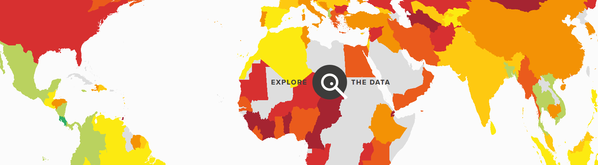

```{r setup, include=FALSE}
knitr::opts_chunk$set(echo = TRUE)
```

## 

```{r,eval=F,echo=F}
library(knitr)
library(DT)
DT::datatable(World)
kable(World)
```


## [Happy Planet Index](http://happyplanetindex.org/)


