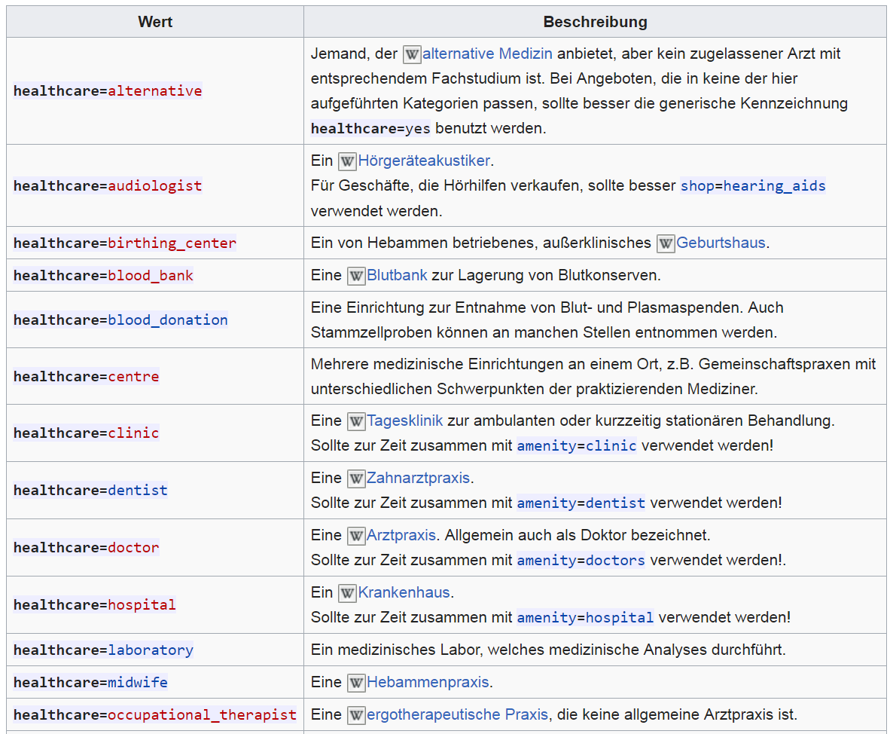
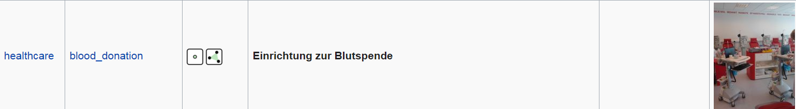

```{r setup, include=FALSE}
knitr::opts_chunk$set(echo = TRUE,eval=F)
```

##


## 


```{r}
library("osmdata")
```

- Umriss für Deutschland

```{r}
bbox <- getbb("Deutschland")
```


## [DE:Key:healthcare](https://wiki.openstreetmap.org/wiki/DE:Key:healthcare)




## blood donation




```{r,eval=F,echo=F}
dat_osm <- extract_osm_objects(key='healthcare',
value="blood_donation",bbox=bbox)
```

https://overpass-turbo.eu/

```
node
  [healthcare=blood_donation]
  ({{bbox}});
out;
```

## Alternativmediziner

```
node
  [healthcare=alternative]
  ({{bbox}});
out;
```

```{r}

```


<!--
https://medium.com/fastah-project/a-quick-start-to-maps-in-r-b9f221f44ff3

https://www.andybeger.com/2013/08/06/finding-coordinates-for-cities-etc-with-r/

https://stackoverflow.com/questions/13905098/how-to-get-the-longitude-and-latitude-coordinates-from-a-city-name-and-country-i
-->

## 

```{r,eval=F}
?openmap
```

